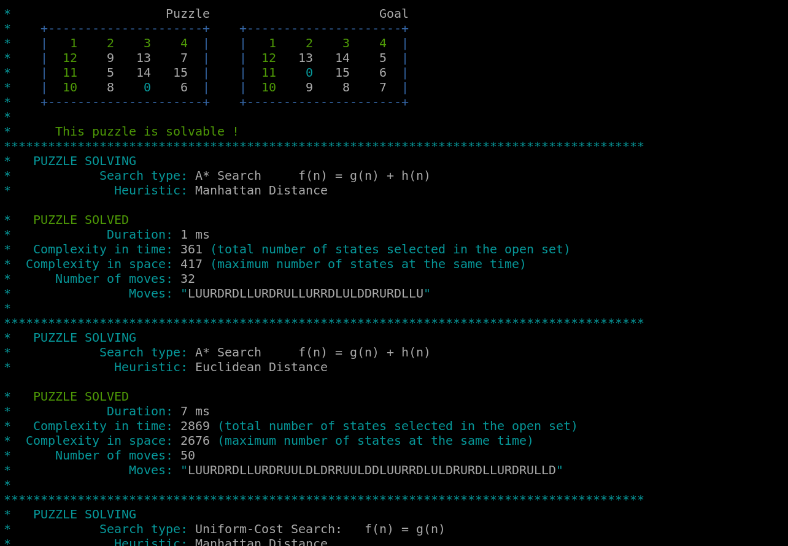

# N-Puzzle - School 42 project


---

This project is an implementation of the N-Puzzle game, developed as part of the curriculum at 42 School. It is coded in **C++** and demonstrates the application of algorithms to solve the puzzle.

## Status:

Validated on 28/01/2025

Grade: 125% ✅

## Description

The N-Puzzle is a sliding puzzle consisting of a square board divided into N \* N smaller sections, with one empty slot. The goal of the game is to rearrange the tiles into a specific configuration by sliding them into the empty slot.

## Features

- The program supports solving N-Puzzle for different sizes (e.g., 3x3, 10x10).
- Allows generating a puzzle OR opening a file containing the puzzle:
  ```
   4
   2 10  4 14
   5  8  1  9
   7  3 12  0
  11 15  6 13
  ```
- Verifies the solvability of the puzzle before attempting to solve it.
- Supports three heuristics for calculating the cost of a solution:
  - **Manhattan Distance**
  - **Euclidean Distance**
  - **Good Place** (number of tiles in the correct position)
- Allows performing searches using different strategies:
  - **A\*** search (with heuristics)
  - **Greedy search** (based solely on heuristic values)
  - **Uniform Cost Search** (based purely on the path cost)
- Plays an animation that shows the steps to solve the puzzle.



## Installation

```bash
git clone https://github.com/fleuryD/42-n-puzzle.git
cd 42-n-puzzle
make
```

## Usage

1. Open or Generate a puzzle with one of the following commands:

```bash

   ./npuzzle ./maps/...	# Open a puzzle file (npuzzle.exe on Windows)
   ./npuzzle -f [id]	# Open a puzzle file with the assistant
   ./npuzzle -g [size]	# Generate a puzzle
   ./npuzzle -gpy size [-s -u -i]	# Python generator from the subject

```

2. Optional arguments :

```bash

   -he	# Heuristic: Euclidean Distance
   -hm	# Heuristic: Manhattan Distance
   -hg	# Heuristic: Good Place
   -astar	# Search: A* (default)
   -greedy	# Search: Greedy
   -uniform	# Search: Uniform Cost Search
   -to duration	# Timeout in seconds (default: 20 / infinite: 0)
   -anim	# Play the animation
```

You can mix the arguments as you like:

```bash
   ./npuzzle -g 4 -hm -he -astar -uniform -anim
```

## Authors

Developed by dFleury as part of the 42 school curriculum.
